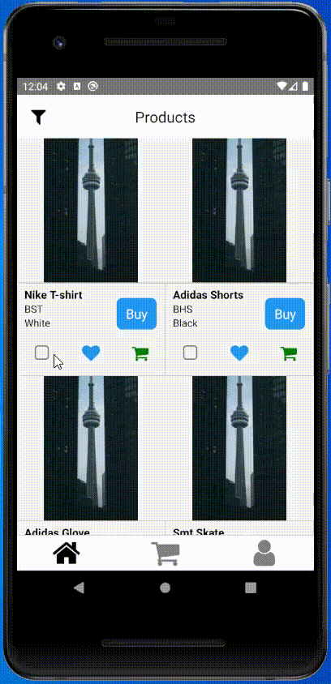
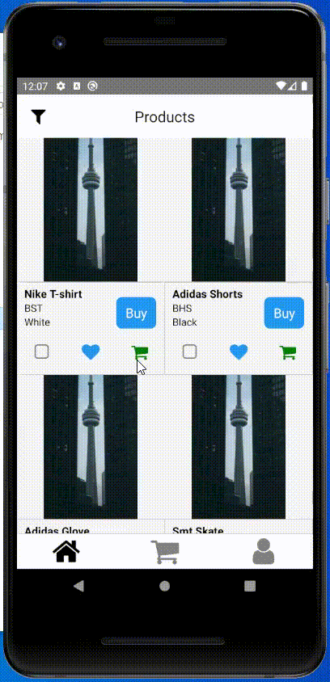
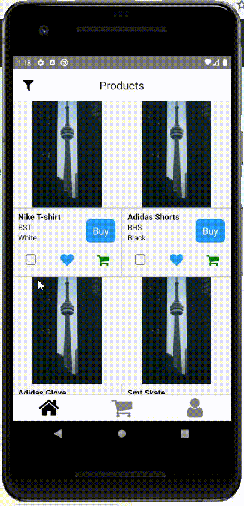
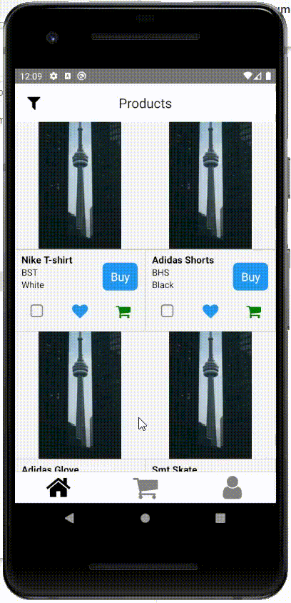

# vanhack-shop-bonsai
This repository is a project created to Bonsai Shop while participating of Vanhackaton recruitment fair.

My objective was to demonstrate my React Native skills while creating a frontend app running on Android.
I also used some of another and great technologies that I would like to mention, like Redux to manage the state of the app, Redux Persist to keep the data stored even the app is closed and Lottie to have some fun animations.

## Running the project

To run this app: 

1 - Download the entire app folder with git clone or download the zip archive, as you prefer. 

2 - Access the root folder of the project and run according to your package manager: `npm install` or `yarn add`.

3 - Before running the project, I would recommend you to access the android folder and run `gradlew clean` until you got success on this comand. Normaly, it's already happens on the first run.

4 - Run `react-native run-android` to run the project on a connected device or an opened simulator.

5 - When the app opens up, some warnings might be showing, well know too as Yellow Boxes. This is because React Native was recently updated to the V0.60+ and the libraries makers need to do some updates on their components too.

## Some notes

These project was created with mocked JSON's to show data in the entire app. As I'm learning some of backends stacks at this moment, currently I wouldn't have how to create an API to fill the app with data. So, my idea was to demonstrate some of Frontend skills and what I could do if being a part of an entire team, with another devs, designers, etc...

## Some features of the app

### Multiple Selector - to select more than one product to add them to the cart

### Product Filter - to find exactly what you want

## Some nice details

### Cart counter - to show to the users how many items they already have inside of the cart

### Liked counter - to show to the users how many items they liked

### Animated checkout process - a beautiful animated checkout process

